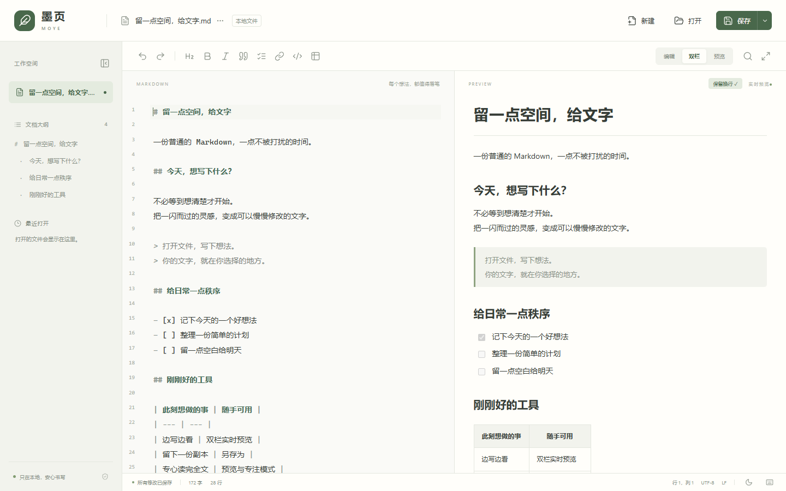
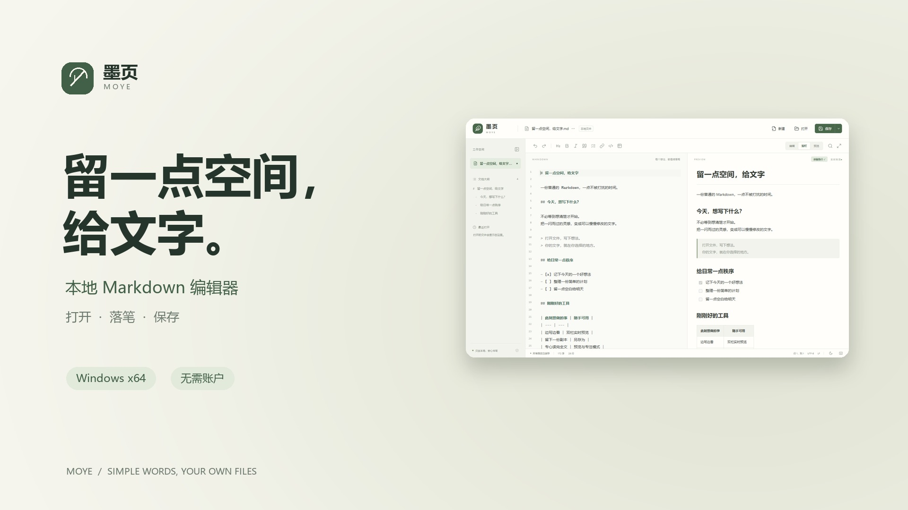
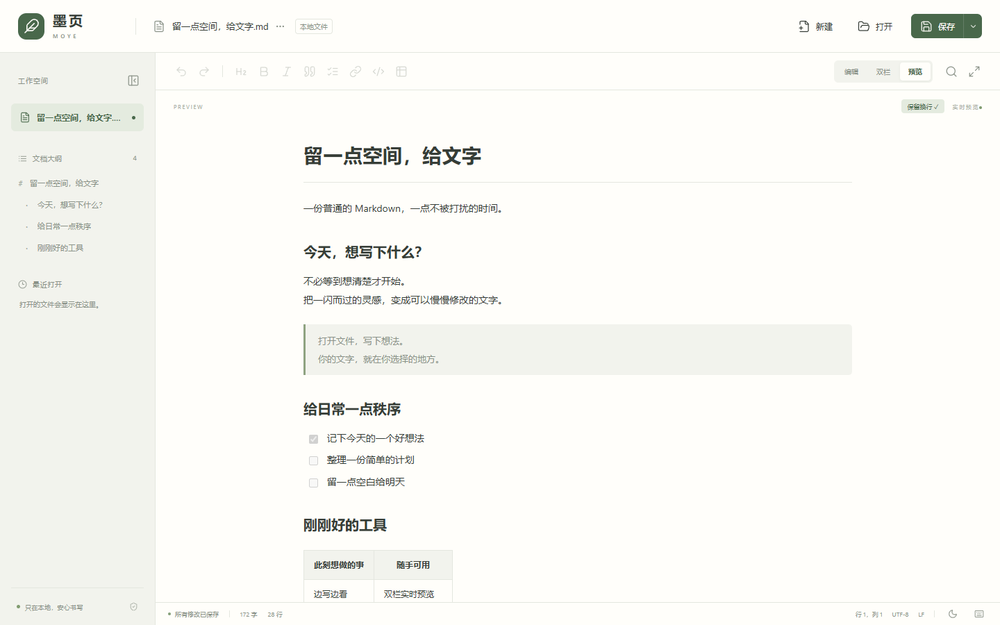
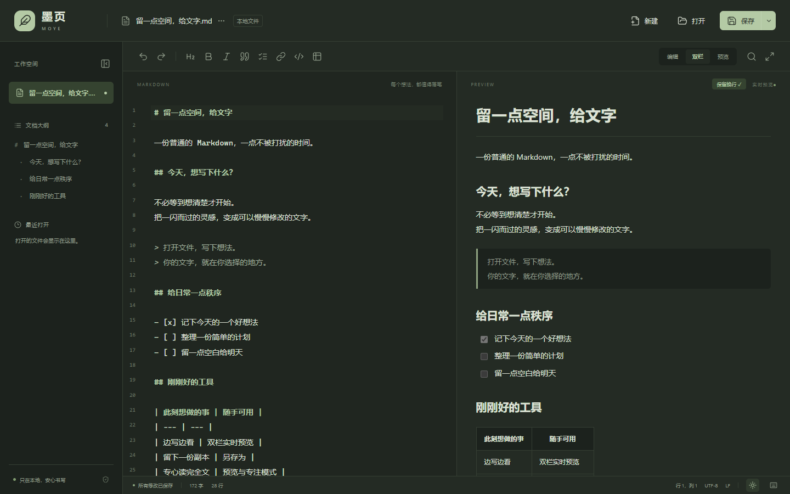
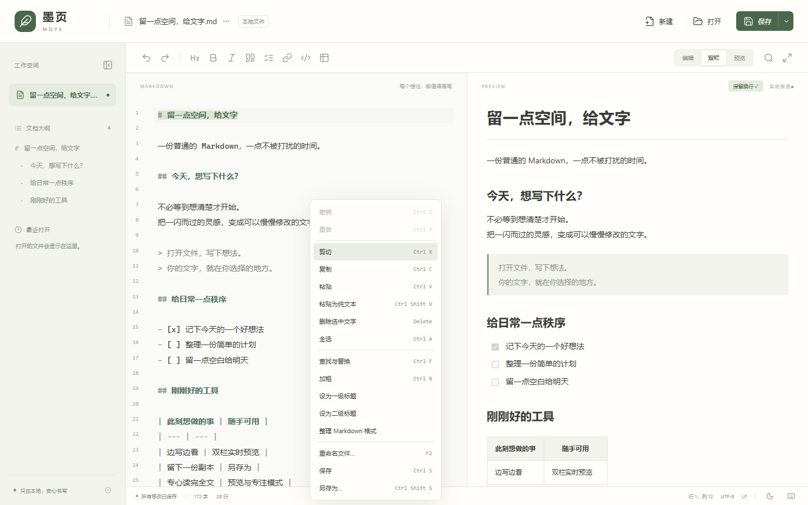
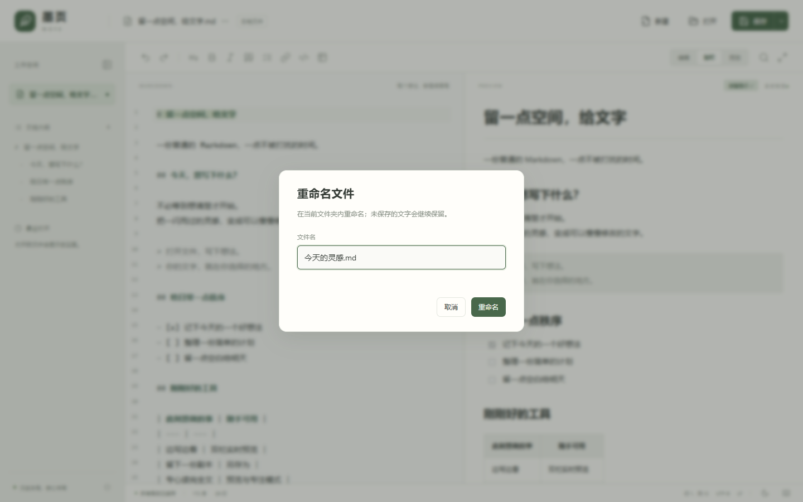

<div align="center">

# 墨页 · MOYE

**留一点空间，给文字。**

一个轻量、离线、直接读写本地文件的 Windows Markdown 编辑器。

Windows 10 / 11 x64 · 便携使用 · 实时预览 · 无账户 · 无资料库

[下载 Windows 便携版](https://github.com/MyLittleShrimp/Moye-MD-Editor-LittleShrimp/releases/latest) · [观看介绍短片](https://github.com/MyLittleShrimp/Moye-MD-Editor-LittleShrimp/releases/download/v1.1.0/Moye-intro-1080p.mp4) · [使用手册](docs/USER_GUIDE.md)

</div>



墨页适合这样的时刻：你只是想打开一份 `.md` 文件，写几行字，保存，然后继续手头的事情。

文件可以放在桌面、项目目录或任何你选择的位置。墨页直接编辑它们，不要求导入资料库，也不提供账户、云同步或联网业务功能。

## 看看墨页

[](docs/media/moye-intro.mp4)

**[观看约 40 秒介绍短片 · 1080p MP4](docs/media/moye-intro.mp4)**

真实界面演示 · 中文动效字幕 · 背景音乐。GitHub 若未直接播放，可打开视频文件后下载观看。

## 刚刚好的编辑工具

| 日常操作 | 墨页如何处理 |
| --- | --- |
| 打开、保存、另存 | 直接读写本地文件；拖入文件即可打开 |
| 文件重命名 | 点击文件名、按 F2 或使用右键菜单；保留未保存的文字和撤销记录 |
| 边写边看 | 编辑、双栏、预览三种视图，配合文档大纲与同步滚动 |
| 常用编辑 | 撤销、重做、剪切、复制、粘贴、全选、查找与替换 |
| 格式粘贴 | 将剪贴板里的标题、加粗、列表、表格转换为 Markdown；支持原样粘贴 |
| 歌词、诗歌 | 预览默认保留原文换行，也能切换为标准 Markdown 换行 |
| 安静地写作 | 浅色 / 深色主题、专注模式、可收起的侧栏 |

### 阅读，也可以很舒服



### 换个主题，继续书写



### 常用操作，随手可用

| 右键编辑菜单 | 点击文件名即可重命名 |
| --- | --- |
|  |  |

以上图片来自 1.1.0 的实际前端界面，使用仓库内的公开示例文档；截图省略 Windows 窗口边框。

## 开始使用

1. 从 **[Releases](https://github.com/MyLittleShrimp/Moye-MD-Editor-LittleShrimp/releases/latest)** 下载 Windows x64 便携包，也可以按下文从源码构建。
2. 解压整个文件夹，双击 `Moye.exe`。
3. 点击“打开”，或将 Markdown 文件拖入窗口。
4. 用 **Ctrl+S** 保存，用 **Ctrl+Shift+S** 另存到你选择的位置。

请将 EXE、DLL 和 `ui` 文件夹放在一起，**不要只复制 EXE**。软件没有自动保存；切换文档或退出时会提醒保存未完成的修改。

**运行环境：** Windows 10 / 11 x64、.NET Framework 4.8、[Microsoft Edge WebView2 Runtime](https://developer.microsoft.com/microsoft-edge/webview2/)。便携包复用系统运行环境，不捆绑完整浏览器。

### 设为默认 Markdown 编辑器

右键 `.md` 文件 → **打开方式 → 选择其他应用 → 在电脑上选择应用**，找到解压后的 `Moye.exe`，选择“始终”。

常用扩展名是 `.md`、`.markdown`；`.mdown`、`.mkd`、`.mkdn` 可按需关联。关联后移动软件文件夹，需要重新指定路径。墨页不会自行修改系统文件关联。

## Markdown 与文件兼容性

- **可预览：** 常用 Markdown、GFM 表格、任务列表、删除线、脚注、安全的内嵌 HTML 和相对路径本地图片。
- **原文保留：** YAML front matter 保留在文件中，预览不显示；Mermaid、LaTeX、MDX、双链等专用语法保留源码，暂不专门渲染。
- **编码：** UTF-8、带 BOM 的 UTF-16/32；非 UTF-8 文本尝试 GB18030。可手动指定 UTF-8、GB18030 / GBK、Windows-1252。历史编码自动判断可能有歧义。
- **保存：** 保留原编码和 BOM；未修改文件另存时保留原始字节，编辑后使用原文件占比最高的换行方式。同目录原子替换保存，并检测外部修改。
- **离线边界：** 不加载远程图片，不联网打开外部链接；本地图片仅限当前文档目录及其子目录。
- **当前限制：** 单文件最多 64 MB；超过 200 万字符暂停预览。不提供自动保存、崩溃恢复、多标签页或云同步。

完整操作说明见 **[使用手册](docs/USER_GUIDE.md)**，版本变化见 **[CHANGELOG](CHANGELOG.md)**。

## 常用快捷键

| 操作 | 快捷键 |
| --- | --- |
| 新建 / 打开 | Ctrl+N / Ctrl+O |
| 保存 / 另存为 | Ctrl+S / Ctrl+Shift+S |
| 重命名 | F2 |
| 原样粘贴 | Ctrl+Shift+V |
| 查找 / 替换 | Ctrl+F / Ctrl+H |
| 加粗 / 斜体 | Ctrl+B / Ctrl+I |
| 编辑 / 双栏 / 预览 | Ctrl+1 / Ctrl+2 / Ctrl+3 |
| 专注模式 | F11，Esc 退出 |
| 撤销 / 重做 | Ctrl+Z / Ctrl+Y |

## 从源码构建

在 Windows x64 上安装 Node.js 24 和 npm。原生外壳使用系统 .NET Framework C# 编译器，无需 Visual Studio。首次构建需要联网下载 npm 依赖及固定版本的 WebView2 SDK；构建后的软件可离线使用。

```powershell
npm.cmd ci
npm.cmd test
powershell -NoProfile -ExecutionPolicy Bypass -File scripts/test-native.ps1
powershell -NoProfile -ExecutionPolicy Bypass -File scripts/build.ps1 -OutputName Moye-1.1.0
```

完整产物位于 `release/Moye-1.1.0/`。

```powershell
# 浏览器界面测试：需要本机安装 Microsoft Edge
npm.cmd run test:ui

# 真实 WebView2 / 文件 / 剪贴板集成测试：先完成上述构建
powershell -NoProfile -ExecutionPolicy Bypass -File scripts/test-integration.ps1
```

集成测试使用隔离文档和配置目录，会把测试内容写入系统剪贴板。最近一次本机验证：22 个渲染与粘贴测试、79 项文件检查、54 项界面检查、7 项原生集成检查，详见 [验证记录](VERIFICATION.md)。GitHub Actions 配置包含单元检查、Windows 构建及界面测试；云端运行结果以仓库 Actions 页面为准。

### 项目结构

```text
native/               WinForms 外壳、文件读写与系统剪贴板
src/                  CodeMirror 编辑器、预览、粘贴与界面样式
tests/                渲染、粘贴、文件与界面测试
examples/             可公开的示例 Markdown
docs/images/          README 截图与视频封面
docs/media/           宣传片、字幕、分镜与素材说明
scripts/              构建、测试、许可收集、发布包导出
scripts/media/        可复现的截图与视频制作脚本
.github/workflows/    Windows 自动构建
```

`node_modules/`、`.build/`、`dist/`、`release/`、`test-results/` 均为本地生成目录，不提交到仓库。

## 技术与许可

本项目采用 **[Apache License 2.0](LICENSE)**。

墨页使用 C# / WinForms、WebView2、CodeMirror 6、markdown-it、DOMPurify、Turndown 和 Lucide。便携包附带依赖的 `THIRD-PARTY-NOTICES.txt`；这些第三方组件保留各自许可证。素材来源与制作方式见 [宣传素材说明](docs/media/README.md)。
